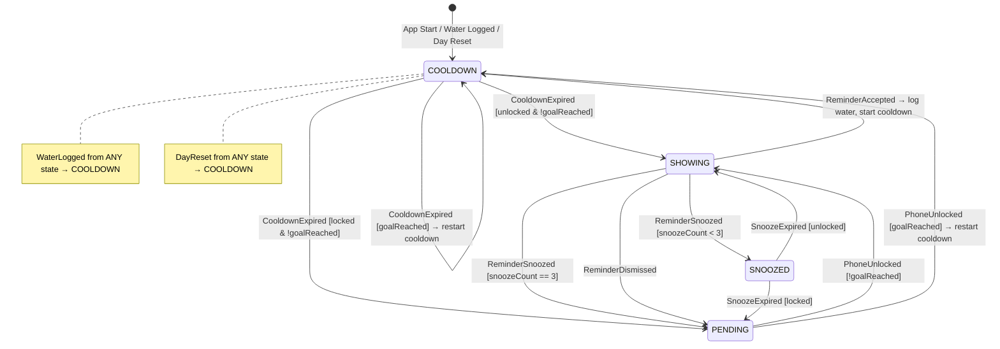

# Hydra Reminder Engine — Event-Driven FSM Design

## 1. States (4)

Each state represents a **distinct behavioral mode** of the reminder engine. No state exists to hold data — that's metadata's job.

| State | Behavioral Mode |
|---|---|
| `COOLDOWN` | A cooldown timer is running. No reminders are allowed. This is the initial state on app start, after a water log, and after a day reset. |
| `PENDING` | Exactly one reminder is queued, waiting for the device to unlock. No timers running. |
| `SHOWING` | A reminder notification is currently visible to the user. Awaiting user action. |
| `SNOOZED` | The user snoozed a reminder. A snooze timer is running. |



---

## 2. Events (8)

Events are the **only** way the FSM transitions. No transition happens outside an event.

| Event | Source | Description |
|---|---|---|
| `WaterLogged` | User action (Dashboard, Notification) | User drank water. **Global**: handled from ANY state. |
| `CooldownExpired` | Timer callback | The cooldown timer completed. |
| `PhoneUnlocked` | `ACTION_USER_PRESENT` broadcast | Device was unlocked. **Global**: handled from ANY state (no-op in most). |
| `SnoozeExpired` | Timer callback | The snooze timer completed. |
| `ReminderAccepted` | Notification action | User tapped "Drank Water" on notification. |
| `ReminderSnoozed` | Notification action | User tapped "Snooze" on notification. |
| `ReminderDismissed` | Notification action | User tapped "Dismiss" on notification. |
| `DayReset` | Midnight alarm / WorkManager | A new calendar day started. **Global**: handled from ANY state. |

---

## 3. Transition Table

### 3a. Global Transitions (apply from ANY state)

| Event | Next State | Side Effects |
|---|---|---|
| `WaterLogged` | `COOLDOWN` | Cancel all timers. Clear `pendingReminder`. Reset `snoozeCount = 0`. Store `lastDrinkTimestamp`. Cancel visible notification. Start cooldown timer. |
| `DayReset` | `COOLDOWN` | Cancel all timers. Clear `pendingReminder`. Reset `snoozeCount = 0`. Reset `dailyWaterConsumed = 0`. Set `goalReached = false`. Cancel visible notification. Start cooldown timer. |

### 3b. State-Specific Transitions

| Current State | Event | Guard | Next State | Side Effects |
|---|---|---|---|---|
| `COOLDOWN` | `CooldownExpired` | `!goalReached && unlocked` | `SHOWING` | Show notification. Store `lastReminderShownAt`. Set `reminderReason = COOLDOWN_COMPLETE`. |
| `COOLDOWN` | `CooldownExpired` | `!goalReached && locked` | `PENDING` | Set `pendingReminder = true`. Set `reminderReason = COOLDOWN_COMPLETE`. |
| `COOLDOWN` | `CooldownExpired` | `goalReached` | `COOLDOWN` | Restart cooldown timer (suppress reminder). |
| `COOLDOWN` | `PhoneUnlocked` | — | `COOLDOWN` | No-op. |
| `COOLDOWN` | `SnoozeExpired` | — | `COOLDOWN` | No-op (stale event). |
| `PENDING` | `PhoneUnlocked` | `!goalReached` | `SHOWING` | Show notification. Clear `pendingReminder`. Store `lastReminderShownAt`. |
| `PENDING` | `PhoneUnlocked` | `goalReached` | `COOLDOWN` | Clear `pendingReminder`. Restart cooldown (suppress reminder). |
| `PENDING` | `CooldownExpired` | — | `PENDING` | No-op (stale event). |
| `PENDING` | `SnoozeExpired` | — | `PENDING` | No-op (stale event). |
| `SHOWING` | `ReminderAccepted` | — | `COOLDOWN` | Log water. Reset `snoozeCount = 0`. Cancel notification. Start cooldown timer. |
| `SHOWING` | `ReminderSnoozed` | `snoozeCount < 3` | `SNOOZED` | Increment `snoozeCount`. Cancel notification. Start snooze timer. |
| `SHOWING` | `ReminderSnoozed` | `snoozeCount == 3` | `PENDING` | Set `pendingReminder = true`. Reset `snoozeCount = 0`. Cancel notification. Set `reminderReason = SNOOZE_LIMIT`. |
| `SHOWING` | `ReminderDismissed` | — | `PENDING` | Set `pendingReminder = true`. Cancel notification. Set `reminderReason = USER_DISMISSED`. |
| `SHOWING` | `PhoneUnlocked` | — | `SHOWING` | No-op. |
| `SNOOZED` | `SnoozeExpired` | `unlocked` | `SHOWING` | Show notification. Store `lastReminderShownAt`. Set `reminderReason = SNOOZE_EXPIRED`. |
| `SNOOZED` | `SnoozeExpired` | `locked` | `PENDING` | Set `pendingReminder = true`. Set `reminderReason = SNOOZE_EXPIRED`. |
| `SNOOZED` | `PhoneUnlocked` | — | `SNOOZED` | No-op (snooze timer still running). |
| `SNOOZED` | `CooldownExpired` | — | `SNOOZED` | No-op (stale event). |

---

## 4. Metadata

The FSM tracks only the current state. All contextual information lives in `ReminderMetadata`:

```kotlin
data class ReminderMetadata(
    val lastDrinkTimestamp: Long = 0L,
    val cooldownEndsAt: Long = 0L,
    val snoozeEndsAt: Long = 0L,
    val snoozeCount: Int = 0,
    val pendingReminder: Boolean = false,
    val reminderReason: ReminderReason = ReminderReason.COOLDOWN_COMPLETE,
    val lastReminderShownAt: Long = 0L,
    val dailyWaterConsumed: Int = 0,
    val dailyGoal: Int = 2000,
    val goalReached: Boolean = false
)

enum class ReminderReason {
    COOLDOWN_COMPLETE,
    SNOOZE_EXPIRED,
    SNOOZE_LIMIT,
    USER_DISMISSED,
    PHONE_UNLOCK,
    SOCIAL_APP_USAGE      // future: app usage detection
}
```

---

## 5. Transition Reducer (Pseudocode)

The core of the engine. A **pure function** that takes current state + event → returns next state + side effects.

```
function reduce(state, metadata, event) → (newState, newMetadata, sideEffects)

    // ─── GLOBAL TRANSITIONS (override everything) ───
    if event == WaterLogged:
        return (
            COOLDOWN,
            metadata.copy(
                lastDrinkTimestamp = now(),
                snoozeCount = 0,
                pendingReminder = false,
                dailyWaterConsumed += event.amountMl,
                goalReached = (dailyWaterConsumed + event.amountMl) >= dailyGoal,
                cooldownEndsAt = now() + cooldownDuration
            ),
            [CancelAllTimers, CancelNotification, StartCooldownTimer]
        )

    if event == DayReset:
        return (
            COOLDOWN,
            metadata.copy(
                snoozeCount = 0,
                pendingReminder = false,
                dailyWaterConsumed = 0,
                goalReached = false,
                cooldownEndsAt = now() + cooldownDuration
            ),
            [CancelAllTimers, CancelNotification, StartCooldownTimer]
        )

    // ─── STATE-SPECIFIC TRANSITIONS ───
    match state:
        COOLDOWN:
            if event == CooldownExpired:
                if metadata.goalReached:
                    return (COOLDOWN, metadata.copy(cooldownEndsAt = now() + cooldownDuration), [StartCooldownTimer])
                if isDeviceUnlocked():
                    return (SHOWING, metadata.copy(lastReminderShownAt = now(), reminderReason = COOLDOWN_COMPLETE), [ShowNotification])
                else:
                    return (PENDING, metadata.copy(pendingReminder = true, reminderReason = COOLDOWN_COMPLETE), [])

            if event == PhoneUnlocked:
                return (COOLDOWN, metadata, [])  // no-op

        PENDING:
            if event == PhoneUnlocked:
                if metadata.goalReached:
                    return (COOLDOWN, metadata.copy(pendingReminder = false, cooldownEndsAt = now() + cooldownDuration), [StartCooldownTimer])
                return (SHOWING, metadata.copy(pendingReminder = false, lastReminderShownAt = now()), [ShowNotification])

        SHOWING:
            if event == ReminderAccepted:
                return (COOLDOWN, metadata.copy(
                    snoozeCount = 0,
                    lastDrinkTimestamp = now(),
                    dailyWaterConsumed += 250,
                    goalReached = (dailyWaterConsumed + 250) >= dailyGoal,
                    cooldownEndsAt = now() + cooldownDuration
                ), [LogWater, CancelNotification, StartCooldownTimer])

            if event == ReminderSnoozed:
                if metadata.snoozeCount < 3:
                    return (SNOOZED, metadata.copy(
                        snoozeCount += 1,
                        snoozeEndsAt = now() + snoozeDuration
                    ), [CancelNotification, StartSnoozeTimer])
                else:
                    return (PENDING, metadata.copy(
                        snoozeCount = 0,
                        pendingReminder = true,
                        reminderReason = SNOOZE_LIMIT
                    ), [CancelNotification])

            if event == ReminderDismissed:
                return (PENDING, metadata.copy(
                    pendingReminder = true,
                    reminderReason = USER_DISMISSED
                ), [CancelNotification])

        SNOOZED:
            if event == SnoozeExpired:
                if isDeviceUnlocked():
                    return (SHOWING, metadata.copy(lastReminderShownAt = now(), reminderReason = SNOOZE_EXPIRED), [ShowNotification])
                else:
                    return (PENDING, metadata.copy(pendingReminder = true, reminderReason = SNOOZE_EXPIRED), [])

            if event == PhoneUnlocked:
                return (SNOOZED, metadata, [])  // no-op, snooze still running

    // Unhandled event in this state — no-op
    return (state, metadata, [])
```

---

## 6. Why This Scales

| Future Feature | How It Integrates |
|---|---|
| **AI-based timing** | Add a new `ReminderReason.AI_SUGGESTED`. The AI module emits a `CooldownExpired`-like event; the FSM handles it identically. |
| **Social app reminders** | Add `ReminderReason.SOCIAL_APP_USAGE`. UsageStats module detects app usage → emits event → FSM transitions to `SHOWING` or `PENDING`. |
| **Multiple healthy habits** | Each habit gets its own `ReminderStateManager` instance with its own FSM + metadata. The architecture is already per-concern. |
| **Health Connect** | Feed hydration data from Health Connect as `WaterLogged` events. The FSM doesn't care about the source. |
| **Wearable integration** | Wearable logs water → `WaterLogged` event. Same global transition handles it. |

---

## 7. Implementation Plan

| File | Purpose |
|---|---|
| `model/ReminderState.kt` | `enum class ReminderState { COOLDOWN, PENDING, SHOWING, SNOOZED }` |
| `model/ReminderEvent.kt` | `sealed class ReminderEvent` with all 8 events |
| `model/ReminderMetadata.kt` | Data class with all metadata fields |
| `model/ReminderReason.kt` | `enum class ReminderReason` |
| `service/ReminderStateManager.kt` | The reducer + timer orchestration. Single source of truth. |
| `service/UnlockReceiver.kt` | `BroadcastReceiver` for `ACTION_USER_PRESENT` → emits `PhoneUnlocked` |
| `service/ReminderForegroundService.kt` | Hosts `ReminderStateManager`, registers receivers, runs timers |

> [!NOTE]
> The existing `NotificationHelper` and `NotificationActionReceiver` will be refactored to dispatch events to `ReminderStateManager` instead of directly modifying the database.
