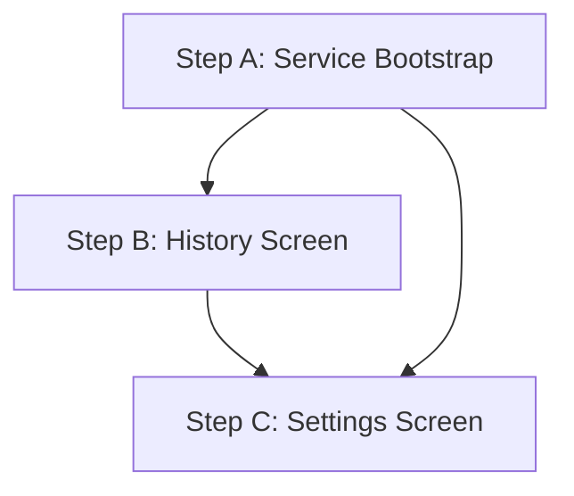

# Hydra — Remaining Implementation Plan

## Goal
Complete the MVP by implementing the 3 remaining feature areas in dependency order so every step produces a buildable, testable checkpoint:

1. **Step A — Service Bootstrap** — Start `ReminderForegroundService` from `MainActivity` and request runtime permissions
2. **Step B — History Screen** — Daily log view grouped by date, with undo swipe-to-delete
3. **Step C — Settings Screen** — Daily goal slider, cooldown picker, quiet hours, and reminder toggles

---

## Current State

| Area | Status |
|---|---|
| Navigation (3-tab) | ✅ Done |
| Room + Repositories | ✅ Done |
| DataStore + Preferences | ✅ Done |
| Dashboard UI + ViewModel | ✅ Done |
| FSM Reminder Engine | ✅ Done |
| Notification channels + actions | ✅ Done |
| ReminderForegroundService (defined) | ⚠️ Defined but never started |
| History screen | ❌ Placeholder |
| Settings screen | ❌ Placeholder |

---

## Step A — Service Bootstrap

### Problem
`ReminderForegroundService` is fully implemented but never started. The FSM cooldown timer is never armed. On Android 13+, `POST_NOTIFICATIONS` requires a runtime permission request before any notification can appear.

### Changes

---

#### [MODIFY] `MainActivity.kt`

Add three responsibilities on `onCreate`:
1. Request `POST_NOTIFICATIONS` permission (Android 13+)
2. Start `ReminderForegroundService` if not already running
3. Arm the initial FSM cooldown if the engine has never run (cold start)

```kotlin
// In onCreate, after setContent:
requestNotificationPermissionIfNeeded()
startReminderService()

private fun requestNotificationPermissionIfNeeded() {
    if (Build.VERSION.SDK_INT >= Build.VERSION_CODES.TIRAMISU) {
        if (checkSelfPermission(POST_NOTIFICATIONS) != PERMISSION_GRANTED) {
            requestPermissions(arrayOf(POST_NOTIFICATIONS), 0)
        }
    }
}

private fun startReminderService() {
    val intent = Intent(this, ReminderForegroundService::class.java)
        .apply { action = ReminderForegroundService.ACTION_START }
    ContextCompat.startForegroundService(this, intent)
}
```

#### [MODIFY] `HydraApp.kt`

Add a `bootstrap()` method that arms the FSM for a cold start — if the engine has never fired a cooldown (i.e., `cooldownEndsAt == 0`), dispatch `WaterLogged(0)` to start the first cooldown immediately. Called once from `MainActivity.onCreate`.

```kotlin
fun bootstrap() {
    scope.launch {
        val meta = reminderStateStore.getCurrentMetadata()
        if (meta.cooldownEndsAt == 0L) {
            // First ever launch — arm engine with a short initial cooldown
            reminderStateManager.dispatch(
                ReminderEvent.WaterLogged(amountMl = 0, source = WaterLogSource.MANUAL)
            )
        }
    }
}
```

---

## Step B — History Screen

### Design
- Groups all water logs by calendar date (today, yesterday, older)
- Shows daily total per group header alongside goal percentage
- Each log entry shows amount + time + source icon
- Swipe to delete a log entry (with undo Snackbar)
- Pull-to-refresh not needed — Room Flow updates automatically

### New Files

#### [NEW] `viewmodel/HistoryViewModel.kt`

```kotlin
data class DayGroup(
    val date: LocalDate,
    val label: String,          // "Today", "Yesterday", or "Mon 14 Jul"
    val totalMl: Int,
    val goalMl: Int,
    val logs: List<WaterLog>
)

class HistoryViewModel(application: Application) : AndroidViewModel(application) {
    val dayGroups: StateFlow<List<DayGroup>> = combine(
        waterRepository.getAllLogs(),
        preferencesManager.dailyGoalMl
    ) { logs, goal ->
        logs.groupBy { log -> DateUtils.toLocalDate(log.timestamp) }
            .entries
            .sortedByDescending { it.key }
            .map { (date, dayLogs) ->
                DayGroup(
                    date = date,
                    label = formatDateLabel(date),
                    totalMl = dayLogs.sumOf { it.amountMl },
                    goalMl = goal,
                    logs = dayLogs.sortedByDescending { it.timestamp }
                )
            }
    }.stateIn(...)

    fun deleteLog(log: WaterLog) { ... }
}
```

#### [MODIFY] `WaterLogDao.kt`

No new queries needed — `getAllLogs(): Flow<List<WaterLog>>` already exists.

#### [MODIFY] `ui/screens/HistoryScreen.kt`

Replace placeholder with:
- `LazyColumn` of `DayGroupHeader` + `WaterLogItem` rows
- `SwipeToDismissBox` for delete with undo Snackbar
- Empty state when no logs exist

```
┌──────────────────────────────┐
│  Today          1,500 / 2,000│  ← DayGroupHeader (75%)
│  ├─ 08:32  ☕  Custom  350ml │  ← WaterLogItem (swipe to delete)
│  ├─ 10:15  🔔  Notif.  250ml │
│  └─ 12:00  💧  Quick   250ml │
│                               │
│  Yesterday     2,100 / 2,000 │  ← DayGroupHeader (✅ Goal met)
│  ├─ ...                       │
└──────────────────────────────┘
```

---

## Step C — Settings Screen

### Design
Settings that exist in `PreferencesManager` but have no UI:

| Setting | UI Control | Range |
|---|---|---|
| Daily goal | Slider + text | 500 ml – 5,000 ml, step 250 |
| Cooldown duration | SegmentedButton | 30 min / 1 hr / 1.5 hr / 2 hr |
| Quiet hours start | TimePicker dialog | HH:mm |
| Quiet hours end | TimePicker dialog | HH:mm |
| Reminders enabled | Switch | — |

> [!NOTE]
> **Cooldown is NOT shown to the user as "cooldown"**. It is surfaced as "Reminder frequency" with friendly labels (e.g. "Every 30 minutes", "Every hour").

> [!IMPORTANT]
> The unlock reminder delay (5–10s random delay before showing the reminder on unlock) must **NOT** be shown in Settings, per design spec.

### New Files

#### [NEW] `viewmodel/SettingsViewModel.kt`

```kotlin
data class SettingsState(
    val dailyGoalMl: Int = 2000,
    val cooldownMinutes: Int = 60,
    val quietHoursStart: String = "22:00",
    val quietHoursEnd: String = "07:00",
    val remindersEnabled: Boolean = true
)

class SettingsViewModel(application: Application) : AndroidViewModel(application) {
    val settingsState: StateFlow<SettingsState> = combine(
        prefs.dailyGoalMl, prefs.cooldownMinutes, prefs.quietHoursStart,
        prefs.quietHoursEnd, prefs.unlockRemindersEnabled
    ) { ... }.stateIn(...)

    fun setDailyGoal(ml: Int) { ... }
    fun setCooldown(minutes: Int) { ... }
    fun setQuietHoursStart(time: String) { ... }
    fun setQuietHoursEnd(time: String) { ... }
    fun setRemindersEnabled(enabled: Boolean) { ... }
}
```

#### [MODIFY] `ui/screens/SettingsScreen.kt`

Replace placeholder with:
- Daily goal section (Slider + current value display)
- Reminder frequency section (SegmentedButton: 30m / 1h / 1.5h / 2h)
- Quiet hours section (two tappable rows opening `TimePickerDialog`)
- Reminders toggle Switch

---

## Proposed Change Order



Steps B and C are independent of each other. Step A must go first since it validates the FSM is actually running before we build UI that depends on it.

Each step ends with `./gradlew assembleDebug` verification and a git commit.

---

## Verification Plan

### Step A
- Install on device/emulator → confirm persistent notification appears in status bar
- Log water on Dashboard → confirm notification dismisses and reappears after cooldown

### Step B
- Log water 3–4 times → open History → verify grouped by date with correct totals
- Swipe to delete → confirm entry removed and undo restores it

### Step C
- Change daily goal → switch to Dashboard → confirm ring reflects new goal
- Change quiet hours → confirm DateUtils quiet-hours logic uses updated values

### Automated
```bash
./gradlew assembleDebug   # after each step
./gradlew test            # unit tests (ReminderReducer is pure — fully testable)
```

---

## Open Questions

> [!IMPORTANT]
> **Swipe-to-delete for logged water** — if a log was done via a notification, should deleting it in History also update the FSM's `dailyWaterConsumed` metadata? Currently `ReminderMetadata.dailyWaterConsumed` is maintained by the FSM independently of Room. A delete in History would cause a discrepancy until `DayReset`. **My recommendation**: keep them separate for MVP — the dashboard reads from Room (live), the FSM metadata is for reminder suppression only. No behavioral conflict.

> [!NOTE]
> **Settings → cooldown change** — when the user changes the cooldown duration in Settings, should the currently-running cooldown timer be updated immediately, or take effect from the next water log? **My recommendation**: take effect from next water log (simpler, less surprising behavior).
